# AgentFlow 运维自动化 — 企业工作流程图

> 可直接粘贴到飞书文档 / Notion / 语雀 / mermaid.live 中渲染

---

## 图 1: 现状 vs 自动化对比

### 现状（人工运维）

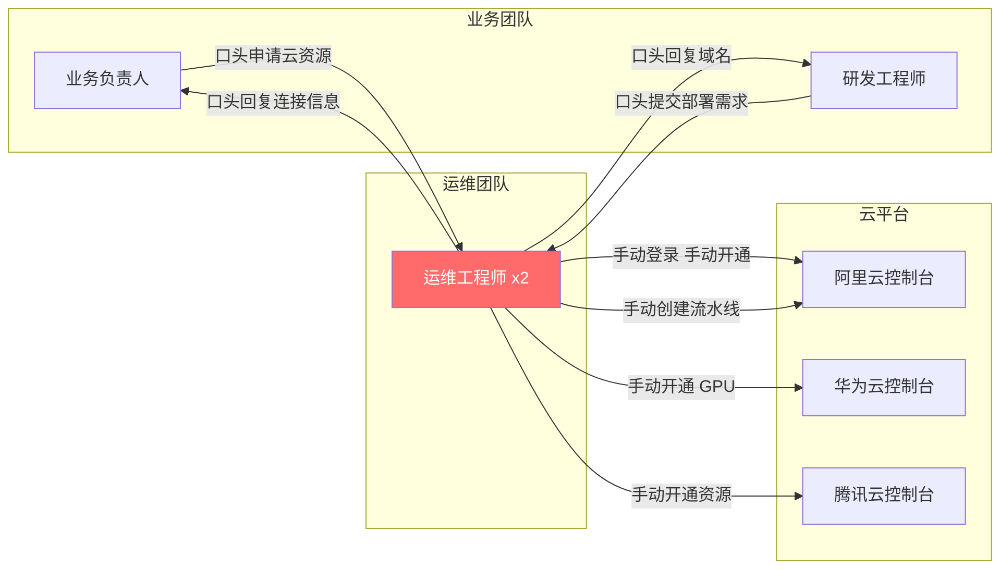

**痛点**: 运维是瓶颈，研发等待时间长，人工操作易出错，无台账无法追溯

### 自动化后（零人工介入）

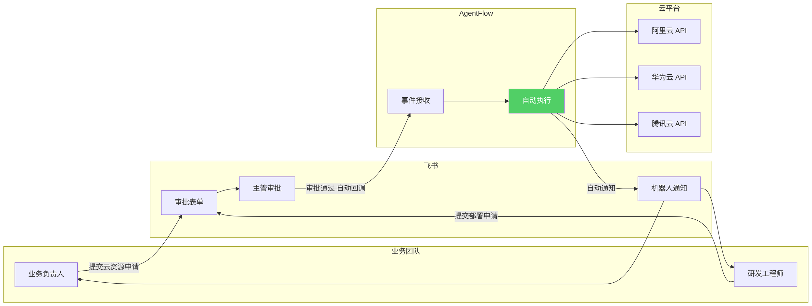

**效果**: 自助、分钟级完成、全程可追溯、零运维人力

---

## 图 2: 项目全生命周期

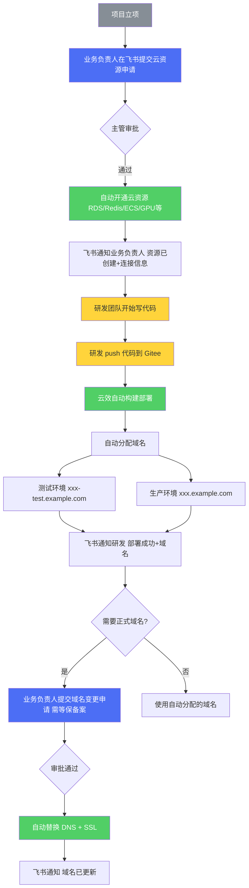

### 关键角色分工

| 阶段 | 操作人 | 操作 |
|------|--------|------|
| 项目立项后 | **业务/项目负责人** | 飞书提交"云资源申请" |
| 资源就绪后 | **暂时还是RD --> 下一步会替换成LLM，砍掉外包RD** | RD 开始写代码 --> LLM vibe coding |
| 代码完成后 | **RD / LLM** | push 到 Gitee 分支，自动部署 + 分配域名 |
| 需要正式域名时 | **业务/项目负责人** | 飞书提交"域名变更申请"（需等保备案） |

---

## 图 3: 云资源开通流程（写代码前）

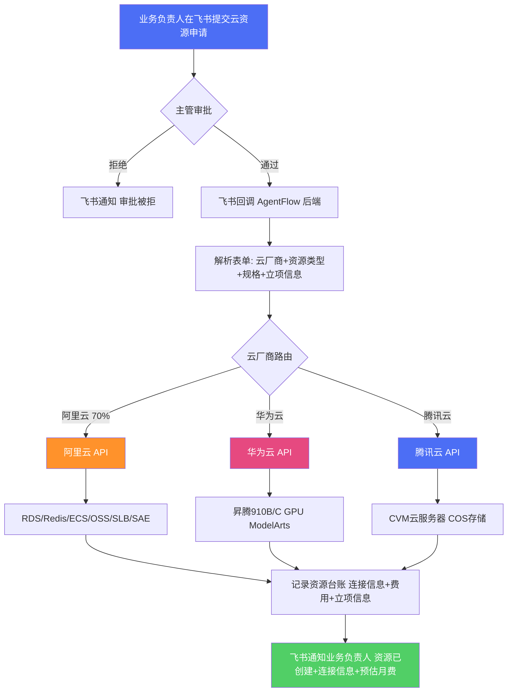

### 审批表单字段

| 字段 | 类型 | 示例值 | 说明 |
|------|------|--------|------|
| 云厂商 | 单选 | 阿里云 / 华为云 / 腾讯云 | |
| 资源类型 | 单选 | RDS MySQL / Redis / OSS / GPU(昇腾/PPU) | |
| 规格 | 文本 | 4核8G / 昇腾910C x2 | |
| 用途说明 | 多行文本 | 订单服务数据库 | |
| 关联项目 | 文本 | order-service | |
| **项目立项否** | **单选** | **是 / 否** | **新增** |
| **立项签报截图/链接** | **附件/链接** | | **新增** |

---

## 图 4: 域名替换流程（需等保备案）

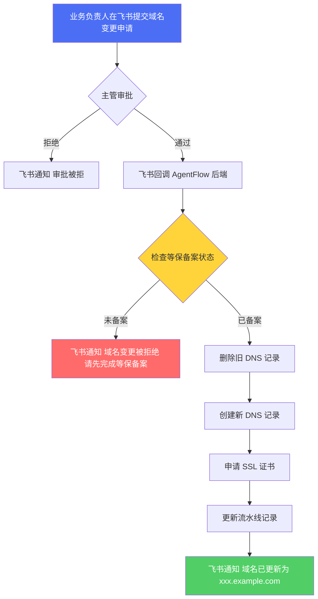

### 审批表单字段

| 字段 | 类型 | 示例值 | 说明 |
|------|------|--------|------|
| 服务名 | 文本 | order-service | |
| 当前域名 | 文本 | order-test.example.com | 自动分配的域名 |
| **正式域名名称** | **文本** | **order.example.com** | **新增** |
| 环境 | 单选 | 测试环境 / 生产环境 | |
| **是否已做过等保备案** | **单选** | **是 / 否** | **新增，必须为"是"** |
| **等保备案证明** | **附件/链接** | | **新增** |

---

## 图 5: 定时任务 — 资源到期提醒 + 月度成本报表

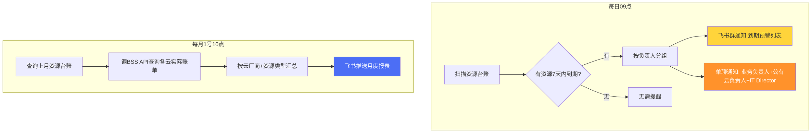

---

## 图 6: 系统整体架构

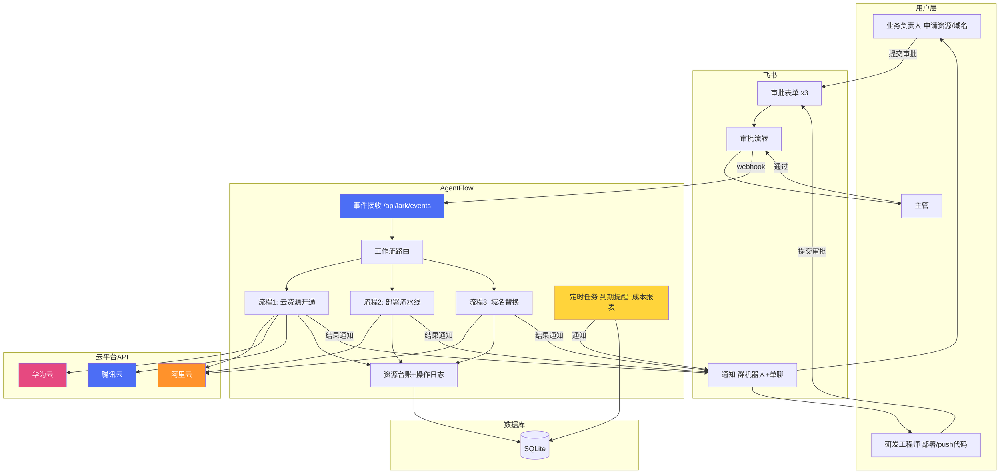

---

## 图 7: Phase 2 — AI 对话式云操作

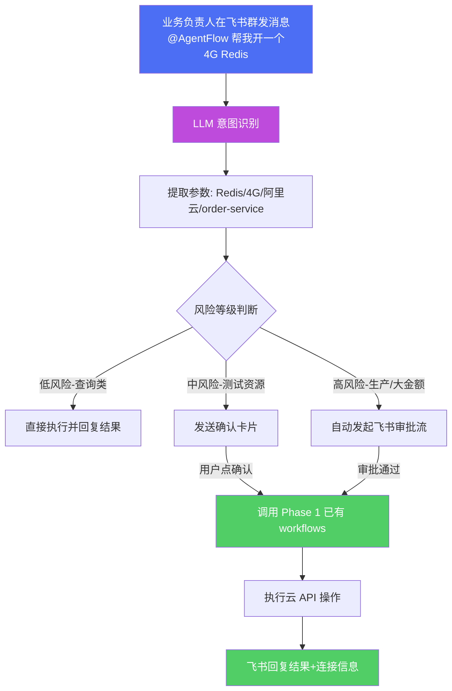

---

## 图 8: Phase 2 — LLM Vibe Coding（干掉RD）

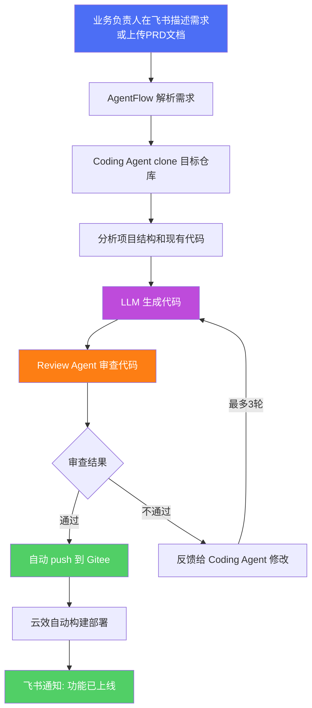

### Coding Agent vs Review Agent 双模型交叉审查

| Agent | 职责 | 建议模型 |
|-------|------|---------|
| Coding Agent | 理解需求 + 生成代码 | Claude（代码能力最强） |
| Review Agent | 安全/质量/逻辑审查 | DeepSeek（交叉审查 + 降本） |

---

## 图 9: Phase 2 完整架构（Phase 1 + Phase 2）

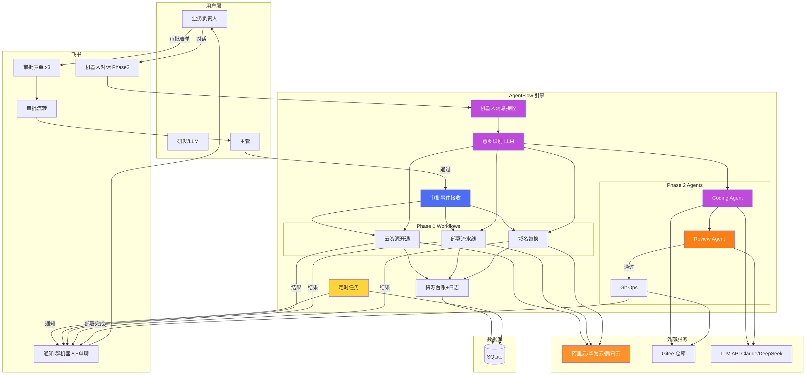

---

## 图 10: 里程碑总览

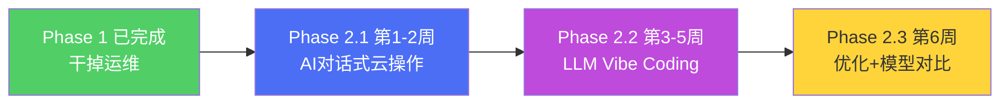

---

## 价值总结

| 维度 | 现状 (人工) | Phase 1 自动化 | Phase 2 AI 驱动 |
|------|------------|---------------|----------------|
| **运维人力** | 2 名运维工程师 | 0 人 | 0 人 |
| **研发人力** | 外包 RD 团队 | 外包 RD 团队 | LLM 替代（0人） |
| **操作方式** | 口头/邮件找运维 | 飞书审批表单 | 飞书对话一句话 |
| **响应速度** | 几小时到几天 | 分钟级 | 秒级 |
| **写代码** | 人工开发 | 人工开发 | LLM 自动生成 + AI 审查 |
| **资源管理** | 无台账 | 自动台账+到期提醒 | 对话查询+智能推荐 |
| **合规性** | 无 | 立项签报+等保备案 | 同 Phase 1 + AI 安全审查 |
